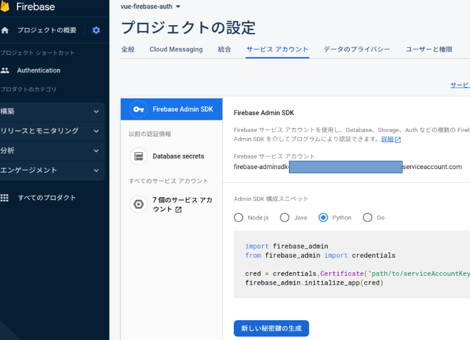

# vue-token-caching-fastapi-firebase-auth

This repository is intended to implement the following features:
- Retrieve a Firebase auth token
- Caching a token in the frontend
- Automatically refresh a cached token

From the API reference of [`getIdToken`](https://firebase.google.com/docs/reference/js/v8/firebase.User#getidtoken), 
you don't need to do anything with the things mentioned above.
All features are automatically done in the Firebase tools library.


## Demo

To execute the API:
```bash
uvicorn api.main:app --reload
```

To run the dev server:
```bash
cd vue-fastapi
npm dev run
```

## Configurations
You need to make sure the configurations are properly set for both FastAPI and Vue.js.
Depending on your setup, port numbers may change, os make sure to adjust them accordingly.

### FastAPI
- CORS: Specify the allowed origins, including correct port number.
```python
# api/main.py:14
allowed_origins = [
    "http://localhost:5173"
]
```
You should also set `allow_methods` and `allow_headers` appropriately.
However, there's no need to modify them for this project.

- Firebase authentication

You need to store the credentials for firebase into `vue-fastapi/firebase_credentials.json`.
You can get this credential from the firebase console.



### Vue
- Backend address: Make sure the backend address is configured correctly.
```javascript
// vue-fastapi/src/plugins/axios.js:6
export default {
    install(app) {
        // base url バックエンド(FastAPI) のURL:port を指定する
        app.config.globalProperties.$http.defaults.baseURL = 'http://127.0.0.1:8000/'
            ...
    }
    ...
}
```

- Firebase authentication

The following variables shall be configured properly and stored in `vue-fastapi/.env.local`.
Please refer to the firebase console and fill them.
This file is not contained in this repo, so make sure to it will be generated.

```.env
VITE_apiKey=****,
VITE_authDomain=****,
VITE_projectId=***,
VITE_storageBucket=****,
VITE_messagingSenderId=****,
VITE_appId=****,
VITE_measurementId=****"
```


## Prerequisites
- python 3.11
- poetry

### Python packages
```bash
poetry add fastapi[all] firebase_admin urllib3==1.26.15
```

### Node.js packages
```bash
cd vue-fastapi/
npm install axios vue-axios firebaseui firebase-tools
npm install
```


## Project memo

- Virtual environment set up
```bash
pyenv local 3.11.3
python -m venv .venv
poetry install
poetry shell
```

